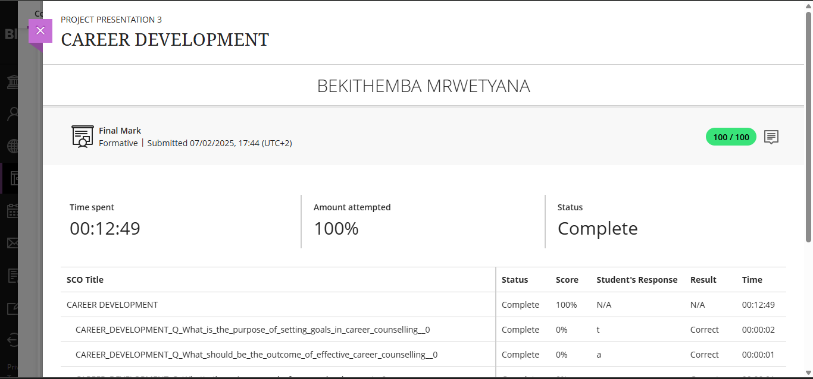
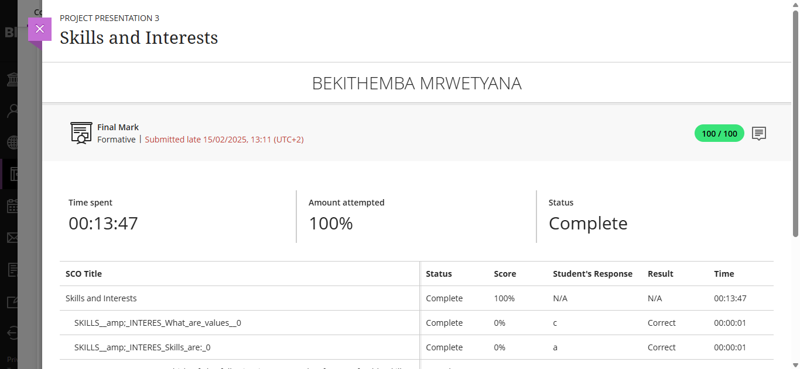
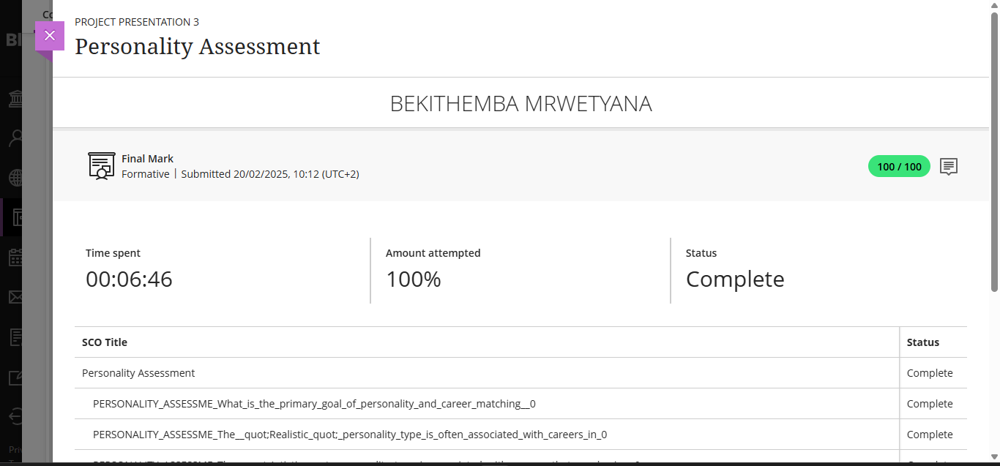
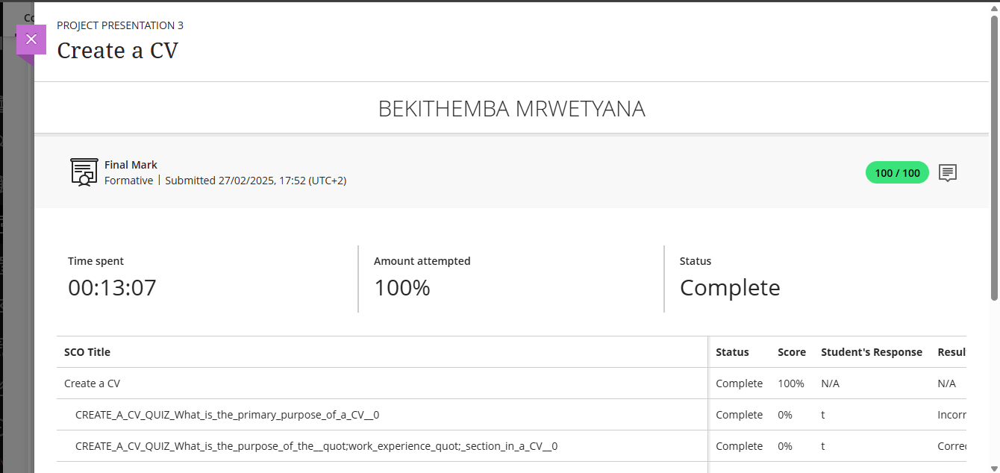
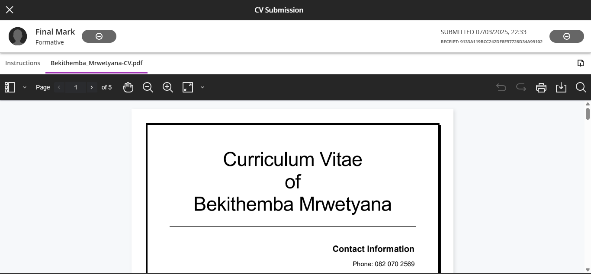

# 🎓 Digital Portfolio

Hi, I'm **Bekithemba Mrwetyana**, a final-year student pursuing a Diploma in ICT Applications Development at CPUT. This digital portfolio showcases my growth and experiences during the Work Readiness Program as part of the PRP370-1-2S module.

It includes key reflections and evidence from career development activities, skills assessments, personality profiling, and professional CV creation. Each section is supported by screenshots and structured using the **STAR technique** to highlight my readiness for the professional environment, along with the values and strengths I will bring to the ICT industry.

---

## 📌 Contents

1. [Career Counselling/Development](#1️⃣-career-counselling)
2. [Skills and Interests](#2️⃣-skills-and-interests)
3. [Personality Assessment](#3️⃣-personality-assessment)
4. [Create a CV](#4️⃣-create-a-cv)
5. [CV Submission](#5️⃣-cv-submission)

---

## 1️⃣ Career Counselling

### 🖼️ Evidence

### 🌟 STAR Reflection

- **S** – I engaged with the *Career Development* section on Blackboard, which emphasized understanding my goals, values, and strengths through reflective exercises, SMART goal-setting, and career planning strategies.  
- **T** – I needed to develop a career development plan that aligns with my core values and long-term aspirations.  
- **A** – I identified my values (growth, creativity, freedom), outlined SMART goals, and explored possible career paths like software development and web development.  
- **R** – I now have a personalized, realistic, and motivating career roadmap and I’ve started identifying opportunities (like internships) that match this path.

---

## 2️⃣ Skills and Interests

### 🖼️ Evidence

### 🌟 STAR Reflection

- **S** – In the *Skills & Interests* topic, I completed value identification exercises and took a quiz to classify my vocational interests using the Holland Code (RIASEC model).  
- **T** – My goal was to understand which skills and interests make me fulfilled and how they match real-world ICT roles.  
- **A** – I discovered that I enjoy problem-solving, and building solutions. I aligned this insight with career options like software engineer, web developer.  
- **R** – I gained a clearer understanding of what makes me engaged and happy at working on a project. This informed how I structured my CV and what kind of work environments I aim for.

---

## 3️⃣ Personality Assessment

### 🖼️ Evidence

### 🌟 STAR Reflection

- **S** – The *Personality Assessment* section helped me reflect on my personality traits, preferences for work environments, and energy sources (e.g., introversion/extroversion).  
- **T** – I needed to evaluate how my personality affects my job satisfaction and team compatibility.  
- **A** – Through the quizzes and reflection prompts, I identified myself as being someone who is highly focused on structure. I realized I work best in calm, structured environments.  
- **R** – I now understand that I thrive in roles that require problem-solving, strategy, and independent work — which reinforces my interest in software and systems development.

---

## 4️⃣ Create a CV

### 🖼️ Evidence

### 🌟 STAR Reflection

- **S** – In the *Create a CV* section, I learned how to format, style, and tailor a CV like a marketing tool — not just a summary.  
- **T** – The objective was to draft a clean, compelling, and relevant CV that presents my best skills and experience clearly.  
- **A** – I followed the provided templates, used action verbs, focused on project-based evidence, and included tech stacks and GitHub links.  
- **R** – I produced a professional CV that reflects my current skills, education, and career focus.

---

## 5️⃣ CV Submission

### 🖼️ Evidence

📎 [View Final CV (PDF)](docs/cv.pdf)

### 🌟 STAR Reflection

- **S** – After applying feedback and polishing my draft, I finalized my CV as part of the submission requirement.  
- **T** – I had to ensure my final CV clearly communicated my readiness for the workplace.  
- **A** – I made improvements like adding a strong personal profile, and aligning skills with roles I’m targeting.  
- **R** – I now have a complete, ready CV tailored to ICT roles, and I am confident in using it for internship or job applications.

---
---

## 🧾 Digital Portfolio Summary

This digital portfolio represents a comprehensive journey through my personal and professional development during the Work Readiness Programme of the PRP370-1-2S module at CPUT.

Each section includes meaningful evidence—from screenshots of Blackboard activities to practical outputs like my CV—and is accompanied by structured STAR reflections that demonstrate my ability to analyze, learn, and grow from each experience.

### Key Highlights:

- 🧭 **Career Counselling**: I explored my personal values and career goals, leading to the development of a clear and motivating career roadmap.
- 🛠️ **Skills and Interests**: Through assessments and guided exercises, I identified my strengths and aligned them with suitable roles in the ICT field.
- 🧬 **Personality Assessment**: I gained deeper insight into how my personality traits influence teamwork, problem-solving, and workplace preferences.
- 📄 **CV Creation**: I developed and refined a professional CV that accurately represents my academic background, technical skills.
- ✅ **Final Submission**: I finalized my CV to meet industry standards and ensure I am job-ready for internships and future employment.

### Learning & Experience:

Through this process, I have improved not only my self-awareness but also critical workplace competencies such as career planning, reflective thinking, and personal branding. This portfolio is a reflection of the knowledge, effort, and growth I have achieved in preparation for transitioning into the ICT industry.

---

## 📬 Contact Information

- **Student Email**: 222706066@mycput.ac.za  
- **Personal Email**: mrwetyanabekithemba69@gmail.com  
- **LinkedIn**: [linkedin.com/in/bekithemba-mrwetyana-663861279](https://www.linkedin.com/in/bekithemba-mrwetyana-663861279)  

---

> 🚨 **Note**: This portfolio is submitted for the PRP370-1-2S module as part of my third-year assessment in ICT Applications Development. All reflections are based on work readiness content from the FID module on Blackboard.
 
